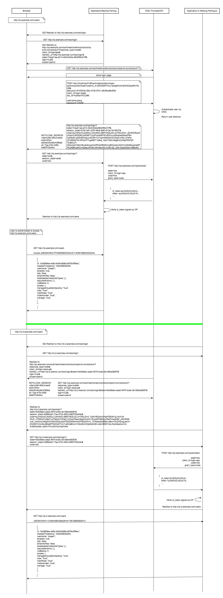
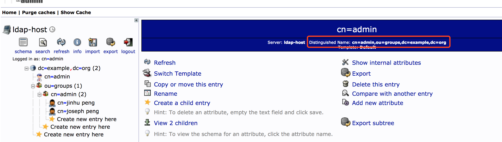
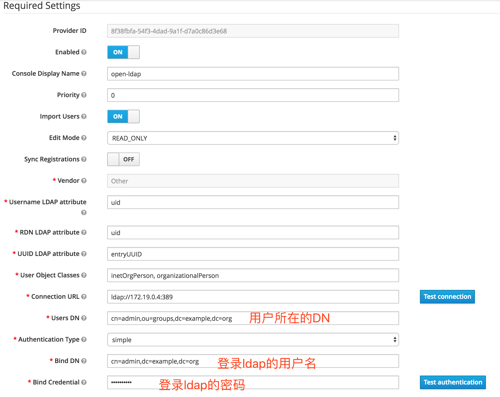
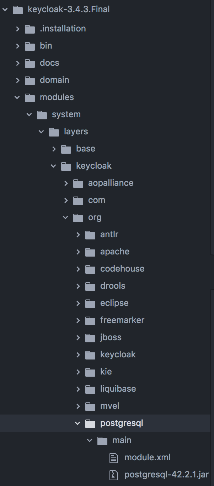

## Setup Spring Security
https://github.com/keycloak/keycloak-documentation/blob/master/securing_apps/topics/oidc/java/spring-security-adapter.adoc

## Setup Keycloak
- create first client: login-app
- create second client: login-backup

## Setup LDAP

- Run docker
    ```
    docker-compose up -d
    ```

## Run First Application(rp)

- config keycloak

    ```
    keycloak.realm=demo
    keycloak.resource=login-app
    keycloak.auth-server-url=http://localhost:8180/auth
    keycloak.ssl-required=external
    keycloak.public-client=true
    keycloak.use-resource-role-mappings=true
    keycloak.confidential-port=0
    keycloak.principal-attribute=preferred_username
    ```

- build application and run
    ```
    java -Dserver.port=8081 -jar keycloak-login-app.jar
    ```
    
## Run Second Application(rp-2)

- config keycloak

    ```
    keycloak.realm=demo
    keycloak.resource=login-backup
    keycloak.auth-server-url=http://localhost:8180/auth
    keycloak.ssl-required=external
    keycloak.public-client=true
    keycloak.use-resource-role-mappings=true
    keycloak.confidential-port=0
    keycloak.principal-attribute=preferred_username
    ```

- build application and run
    ```
    java -Dserver.port=8082 -jar keycloak-login-backup.jar
    ```

## SSO
       
        
## LDAP/AP



## Postgresql
- change datasource

    ```
    <datasources>
        <datasource jndi-name="java:jboss/datasources/ExampleDS" pool-name="ExampleDS" enabled="true" use-java-context="true">
            <connection-url>jdbc:h2:mem:test;DB_CLOSE_DELAY=-1;DB_CLOSE_ON_EXIT=FALSE</connection-url>
            <driver>h2</driver>
            <security>
                <user-name>sa</user-name>
                <password>sa</password>
            </security>
        </datasource>
        <datasource jndi-name="java:jboss/datasources/KeycloakDS" pool-name="KeycloakDS" enabled="true" use-java-context="true">
           <connection-url>jdbc:postgresql://localhost:5432/keycloak</connection-url>
           <driver>postgresql</driver>
           <pool>
               <max-pool-size>20</max-pool-size>
           </pool>
           <security>
               <user-name>keycloak</user-name>
               <password>123456</password>
           </security>
       </datasource>
        <drivers>
            <driver name="h2" module="com.h2database.h2">
                <xa-datasource-class>org.h2.jdbcx.JdbcDataSource</xa-datasource-class>
            </driver>
            <driver name="postgresql" module="org.postgresql">
               <xa-datasource-class>org.postgresql.Driver</xa-datasource-class>
            </driver>
        </drivers>
    </datasources>
    ``` 
- config postgresql module



    ```
    <?xml version="1.0" ?>
    <module xmlns="urn:jboss:module:1.3" name="org.postgresql">

        <resources>
            <resource-root path="postgresql-42.2.1.jar"/>
        </resources>

        <dependencies>
            <module name="javax.api"/>
            <module name="javax.transaction.api"/>
        </dependencies>
    </module>
    ```


## jianshu
https://www.jianshu.com/p/c9b1ecd28813
